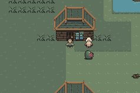

# rustymon
A Pokémon-styled game written in Rust for our computer science capstone project at the University of Kansas.

## Development Environment Setup:

*For cross compilation on Linux to Windows:*
1. Download SDL2 mingw64 devel, SDL2_image mingw64 devel, and SDL2_ttf mingw64 devel from respective repositories
2. Unzip
3. Copy files

`cp -r SDL2-<ver>/x86_64-w64-mingw32/lib/* ~/.rustup/toolchains/stable-x86_64-unknown-linux-gnu/lib/rustlib/x86_64-pc-windows-gnu/lib && cp -r SDL2_image-<ver>/x86_64-w64-mingw32/lib/* ~/.rustup/toolchains/stable-x86_64-unknown-linux-gnu/lib/rustlib/x86_64-pc-windows-gnu/lib`

4. Copy SDL2.dll and SDL2_image.dll from the respective `mingw32/bin` directories into the rustymon folder
5. Download SDL2 ttf win32-x64 zip and extract dll to Rustymon folder.

F*or compilation on macOS for Apple Silicon:*

1. Download the SDL2, SDL2_image, and SDL2_ttf packages from **brew**.

`brew install SDL2 SDL2_image SDL2_ttf`

2. [Export](https://github.com/PistonDevelopers/rust-empty/issues/175#issuecomment-927172098) the proper `LIBRARY_PATH` environment variable to your shell

## Images

