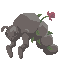
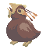
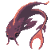

# **Bitaxum**: Earth Type

### Description
A rocky bug stray, bitaxa are sometimes indistinguishable from the soil below. They move slow, dragging their bodies against the ground clumsily, occasionally eating small soft critters from the dirt. A bitaxum that lives for long enough will inevitably find plant life attached to it, living through symbyosis with the bitaxum.

### Base Stats
- HP: 20
- ATK: 20
- DEF: 40
- SPEED: 10

### Starting Moves
- SLAM
- FLAIL

# **Palliub**: Water Type

### Description
A sleak and smooth stray that glides through water as the webbing on its sides slices through the currents. Pallia appear to float like ghosts through the seas. They are found closer to the surface of the water, and, if one is lucky, one might see a palliub or pack of pallia leap out of the water.

### Base Stats
- HP: 15
- ATK: 30
- DEF: 20
- SPEED: 35

### Starting Moves
- WAVE
- SLICE

# **Rubridum**: Fire Type

### Description
An aggressive flying stray, emboldened by the extended and tough beak the protrudes from its head. The long plumes on its head serve, oftentimes, as a distraction to the other strays. It is uncommon to see more than one rubrida at a time, unless you are lucky enough to find them mating.

### Base Stats
- HP: 15
- ATK: 35
- DEF: 25
- SPEED: 25

### Starting Moves
- SCREECH
- PECK

# **Aeternisc**: Time and Water Type

### Description
An immortal stray that lives forever by periodically restarting its life cycle. It is extremely elusive as one of the two known time type strays, and at the same time highly sought after. It floats in the air, though its tentacles move as if it were in water.

### Base Stats
- HP: 50
- ATK: 25
- DEF: 35
- SPEED: 10

### Starting Moves
- REINCARNATE
- FLAIL

# **Solikigoi**: Water Type

### Description
An extremely large and vibrant fish stray. Solikigois can frequently be found in rivers, taking up a significant portion of the width of the river, feeding off of the smaller water strays it pushes up in its way. One will commonly find solikigois with damaged dorsal fins, as they tend to be weaker tissue and tend to stick far out of the water, waving in the wind.

### Base Stats
- HP: 20
- ATK: 15
- DEF: 35
- SPEED: 15

### Starting Moves
- WAVE
- HIGH TIDE

# **Catis**: Earth Type
### Description
A very slow stray with one of the largest mouth to body ratios of the earth types. Catii have very weak teeth and tend to eat bugs and other small strays off of the ground, sucking them into its large mouth. Sometimes they can be found sitting motionless, mouth wide open on the ground, seducing small strays to walk into its mouth.

### Base Stats
- HP: 25
- ATK: 15
- DEF: 30
- SPEED: 10

### Starting Moves
- VORTEX
- BASH

